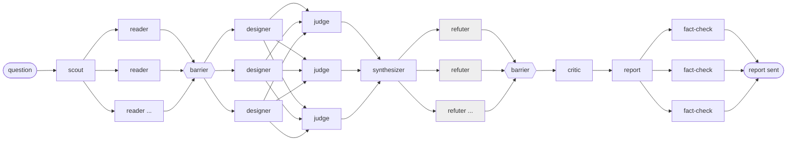

# neo-arc — the multi-agent architecture design method

**Design record for the `neo-arc` plugin.** The method below is the source design, kept as written so the reasoning
behind each stage survives, with its agent names updated to Neo's. What Neo actually ships, and why it differs, is
recorded in [How Neo ships it](#how-neo-ships-it) at the end. The plugin's own overview is
[`plugins/neo-arc/README.md`](../../../plugins/neo-arc/README.md).

---

Oct 8, 2026

## Purpose

A repeatable method for answering an architecture design question with evidence from the codebase, written so it can be extracted into GitHub Copilot custom agents. The questions it fits share a shape: integrate platform X, add capability Y, choose between two patterns, change a contract or data model. The output is a report with a recommended shape, a phased plan, verified reuse claims, the decisions only the user can make, and the single question that gates the design.

The skeleton is always the same: scout, parallel readers, independent designs, judges, synthesis, refutation, critique, report, fact-check. The scale knob is the number of readers and refuters, not the shape. A full question runs 30 to 40 agents; a follow-up on an answered question runs 10 to 20 with a smaller reader set.

Two properties make it work and should survive any port. Every stage returns a fixed template, so the next stage can consume it without a person in between. And every claim the recommendation leans on is handed to a separate agent told to refute it; in the run this was extracted from, about a third of the reuse claims were downgraded that way, which is what kept the report honest.

## The method, step by step

Seven steps. Steps 2, 3, 4 and 5b fan out; everything else is one agent.

1. **Scout inline, then brief the readers.** One agent reads the branch state, folder layout, ADR index and PRD outline, and greps for the subject's keywords to find where the codebase already anticipates it. It produces the reader brief: the areas the question touches, the anchor files for each, and what the question really means when its words are ambiguous. Nothing is spawned until this brief exists.
2. **Parallel readers, one per area, same output contract.** Eight to eleven read-only readers each own one slice. The usual slices: the main execution graph or request path; the extension seam the change would use; the pattern already used to reach an external system; persistence and publishing; deployment and promotion; upstream and downstream contracts; governing documents (ADRs, PRD, decision logs); agent or service wiring; tests and infrastructure. One more reader researches any external product the question names, from primary sources. Every reader returns the same template: summary, existing mentions of the subject, reuse claims graded verbatim / extend / pattern-only / not-reusable with `file:line`, gaps, constraints, facts with evidence.
3. **Three independent designs from assigned angles.** Each designer gets the whole evidence map and one angle: the smallest change behind existing seams; mirror an integration or subsystem that already exists; treat the capability as first-class with its own lifecycle. Same template for all three: what the capability means here, stages, new and reused components by path, settings with defaults, ADR conflicts, human gates, risks, questions only the user can answer.
4. **Judge panel with distinct lenses.** Three judges score every design on reuse, ADR fit, fit to the ask, risk and deliverability, each through one lens: repository maintainer, domain architect, security and governance reviewer. They name factual errors they spot and what to graft from the losing designs.
5. **Synthesize, then refute.** (a) One synthesizer builds a phased recommendation from the consensus winner plus the grafts and lists the load-bearing reuse claims, at most sixteen. (b) Each claim goes to its own refuter, told to read the code and default to "refuted" when unconfirmed. Verdicts carry a corrected reuse grade.
6. **Completeness critic.** One agent asks what nobody read, which claims remain unverified, what is overbuilt given the team's delivery posture, and what single question gates the design.
7. **Report, then fact-check the report.** One agent writes the report from the synthesis and critique (Markdown with Mermaid; an HTML with drawn figures when asked). Three checkers then read the written document: repository facts against the code, external claims against primary sources, structure and rendering. Corrections are applied before the report is sent.

Follow-up questions re-enter at step 1 with a smaller reader set. A reader that returns off-template is re-run once as a plain agent rather than retried against the schema.



Readers fan out and must all return before the designers start; refuters run one per claim and must all return before the critic. The shaded stage is the one that changes the answer most.

## Output contracts

Each stage returns exactly one of these templates and nothing else. In the scripted run they were JSON schemas; in Copilot they become the Markdown each agent's body ends with, and the orchestrator rejects a reply that does not match.

**Reader**

```markdown
## Area
## Summary (150-400 words, for a reader who knows the stack but not this repo)
## Existing mentions of <target>
- <path> — <what>
## Reuse claims
| Component | Path | Grade (verbatim / extend / pattern-only / not-reusable) | How |
## Gaps (what this area lacks for the capability)
## Constraints
- <source> — <rule>
## Facts
- <claim> — <file:line or section>
```

**Design**

```markdown
## Name and thesis
## What the capability means here (one precise definition)
## Stages
| Stage | Where in the graph | new / reused / extended | Description |
## New components
| Name | Folder | Responsibility |
## Reused components
| Component | Path | How |
## Configuration
| Setting | Default | Purpose |
## ADR impact (conflicts with Accepted, amends Proposed, new)
## PRD sections touched
## Human gates
## Risks
## Open questions for the user
## Rough effort
```

**Judge** (one per lens)

```markdown
## Scores (1-5 each; total out of 25)
| Design | Reuse | ADR fit | Fit to the ask | Risk (5 = lowest) | Deliverability | Total | Rationale |
## Winner
## Graft from the others
## Factual errors spotted (with file:line)
```

**Synthesis**

```markdown
## Recommendation (200-400 words)
## Phased plan
| Phase | Delivers | Reuses | Builds | Settings |
## Reuse claims the recommendation depends on (max 16, most load-bearing first)
| Component | Path | Grade | How |
## Not reusable
## ADR work
## PRD work
## Decisions only the user can make
| Question | Why it changes the design | Options | Recommended |
## Judge disagreements
```

**Refuter** (one per claim)

```markdown
## Verdict: refuted | holds
## Confidence: high | medium | low
## Reason
## Evidence (file:line)
## Corrected grade
```

**Critic**

```markdown
## Missing
| What | Why it matters | How to close |
## Unverified claims
## Premature or overbuilt
## Sharpest question for the user
```

**Fact-checker** (one per checker)

```markdown
## Checked: <count>
## Findings
| Severity (error / warning / nit) | File | Claim | Problem | Evidence | Fix |
```

## Mapping to GitHub Copilot custom agents

Ten agents, one per stage, in Copilot's `.agent.md` format (`name`, `description`, `tools`, `agents`, `handoffs`, `user-invocable`, body as system prompt). Only the orchestrator is user-invocable. The worker agents are read-only; only the orchestrator and the report writer edit files.

| Agent | Tools | Input | Output | Runs |
| --- | --- | --- | --- | --- |
| `Neo Arc Engineer` | agent, read, search, edit | the design question | the report file(s) in the repository's reports folder | 1 |
| `Neo Arc Scout` | read, search | the question | reader brief: areas, anchor files, keyword hits, what the question means | 1 |
| `Neo Arc Reader` | read, search, web | one area brief + the question | Reader template | 8-11 in parallel |
| `Neo Arc Designer` | read, search | evidence map + one angle | Design template | 3 in parallel |
| `Neo Arc Judge` | read, search | all designs + one lens | Judge template | 3 in parallel |
| `Neo Arc Synthesizer` | read, search | designs + judgements + evidence map | Synthesis template | 1 |
| `Neo Arc Refuter` | read, search | one reuse claim | Refuter template | one per claim, in parallel |
| `Neo Arc Critic` | read, search | synthesis + verdicts + evidence map | Critic template | 1 |
| `Neo Arc Report` | read, edit | synthesis + critique + verdicts | Markdown report with Mermaid figures; HTML on request | 1 |
| `Neo Arc Factcheck` | read, search, web | the written report + one check kind | Fact-checker template | 3 in parallel |

The angles for `Neo Arc Designer` and the lenses for `Neo Arc Judge` are passed in the prompt, not baked into separate agent files, so the same three files serve every question. The three `Neo Arc Factcheck` kinds are: repository facts (paths, line numbers, statuses, counts), external claims (primary sources only, fetched not searched), and document structure (Mermaid syntax, links, tables, one claim per figure).

## Orchestration rules

The orchestrator's body spells these out, because Copilot has no scripted pipeline to enforce them.

1. Run `Neo Arc Scout` first and keep its brief verbatim; it is the input to every reader prompt.
2. Spawn one `Neo Arc Reader` per area in the brief, in parallel, each with the shared context paragraph (what the system is, what the question asks) plus its own area brief. Add one reader for the external product whenever the question names one.
3. Barrier: wait for every reader. Concatenate the Reader outputs into the evidence map. A reader that returns off-template is re-run once with the template quoted back and "return only this"; if it fails again, note the area as unread in the report.
4. Spawn three `Neo Arc Designer` runs in parallel with the full evidence map and one angle each. Default angles: the smallest change behind existing seams; mirror an integration or subsystem that already exists; the capability as first-class with its own lifecycle.
5. Barrier, then three `Neo Arc Judge` runs in parallel with all designs and one lens each. Default lenses: repository maintainer; domain architect; security and governance reviewer.
6. One `Neo Arc Synthesizer` run with the evidence map, designs and judgements.
7. Spawn one `Neo Arc Refuter` per reuse claim in the synthesis, in parallel, capped at sixteen. Log the count dropped if the cap bites.
8. One `Neo Arc Critic` run with the synthesis, the verdicts and the evidence map.
9. One `Neo Arc Report` run. It writes to the repository's reports folder as `<date>-<topic>-assessment.md` and must carry the refuters' corrected grades, not the synthesizer's original ones.
10. Three `Neo Arc Factcheck` runs in parallel on the written file, one check kind each. Apply every error and warning before presenting the report; list nits unapplied.
11. For a follow-up question, start at step 1 with a reader set sized to the question (two to four areas) and reuse the earlier evidence map as context, not as evidence.

Two guardrails apply to every worker: never edit, create or stage a file, and cite `file:line` for every claim about the repository. The orchestrator never implements anything; it only routes and assembles.

## Adaptations and constraints

The scripted run had three things Copilot does not: schema-enforced output, a deterministic pipeline, and a scratch directory for intermediate results. Each needs a substitute.

- **No schema enforcement.** Every agent body ends with its template and the sentence "Return only this template." The orchestrator checks the headings before passing output on and re-runs once on a mismatch. In the source run roughly one reader in eight still failed its schema, so the re-run rule is not optional.
- **No scripted pipeline.** Fan-out counts, the two barriers (designs need every reader; refuters need the synthesis) and the refuter cap live in the orchestrator prompt. VS Code runs subagents in parallel and the `agents` frontmatter field names which agents a parent may call; `handoffs` are ignored by the cloud agent on github.com, so this runs from VS Code.
- **No scratch directory.** Intermediate outputs travel in prompts. A full evidence map runs to about 170k characters, which is why designers and judges receive it as one block and readers do not receive each other's output.
- **Reports stay untracked.** The report writer puts files in the repository's reports folder and the loop never stages or commits them; an ADR or PRD change is a separate, human-reviewed step the method recommends but never performs.
- **The external-research reader is different.** It uses `web`, must fetch primary sources rather than rely on search snippets, and labels anything it could not fetch as unverified. The external fact-checker holds it to that.
- **Cost.** A full run used 35 agents and roughly 7.4M subagent tokens over 30 minutes; a follow-up used 18 agents and 3.4M. Sizing the reader set to the question is the lever; the design, judge and critic stages are fixed cost.

## Sample agent file

The shipped reader, [`neo.arc-reader.agent.md`](../../../plugins/neo-arc/agents/neo.arc-reader.agent.md), is the worked example. The other workers follow the same shape with their own template: frontmatter, an `## Input` section naming what the orchestrator passes, a constraints list, and a closing template that ends "Return only this template." The orchestrator adds an explicit `agents:` allowlist and `user-invocable: true`.

## Sources

- [Subagents in VS Code Copilot](https://www.dailydoseofghcp.com/posts/subagents-in-vscode-copilot.html): parallel subagents and the `agents` frontmatter field.
- [GitHub Copilot custom agents: the .agent.md guide](https://localskills.sh/blog/copilot-custom-agents-guide): frontmatter keys, handoffs, and the note that the cloud agent on github.com ignores `handoffs`.
- [awesome-copilot agents instructions](https://github.com/github/awesome-copilot/blob/main/instructions/agents.instructions.md): conventions for writing agent files.
- [Best practices for orchestrating multiple agents in Copilot Chat](https://github.com/orgs/community/discussions/192232): community discussion on handoff versus subagent collaboration.

---

## How Neo ships it

The method survives intact — the skeleton, the templates, the barriers, the refuter cap, the re-run-once rule. What
changed is the packaging, to conform to Neo's contracts. Each row names the rule that forced it.

| Source design | Shipped in `neo-arc` | Why |
| --- | --- | --- |
| Ten loose agent files in a repository | `plugins/neo-arc/agents/` | A shipped role lives under `plugins/*/`; `.github/` inside a plugin fails silently. [`plugin-contract.md`](../reference/plugin-contract.md) § 1 |
| Role names under a project prefix | `neo.arc-engineer.agent.md` … `neo.arc-factcheck.agent.md`; `name: Neo Arc Engineer` … | Flat `neo.<role>` form for a single-domain plugin, `Neo <Role>` names; the `arc-` prefix keeps roles unique across plugins. The orchestrator follows the `<Domain> Engineer` entry-point naming of the Product, Specification, and Coding loops. [`plugin-contract.md`](../reference/plugin-contract.md) § 4 |
| A wildcard `agents:` allowlist | An explicit allowlist of the nine exact worker `name:` values | Copilot resolves delegation targets by exact `name:`; the validator rejects entries that don't resolve |
| `version:` and `phase:` frontmatter | Dropped | Provenance keys are not part of the agent frontmatter contract |
| `$ARGUMENTS` input block | Dropped; each worker's `## Input` section names what the orchestrator passes | Not a Copilot agent feature |
| `handoffs` | Not used | Ignored by the harness; orchestration is by subagent invocation via the `agent` tool |
| `tools: [read, search]` / `[read, search, web]` | `[read, search, execute]` / `[read, search, web, execute]`, with shell restricted to read-only commands | Copilot CLI resolves only `read`, `edit`, `execute`, `agent`; `search` and `web` grant nothing. [`agent-authoring-reference.md`](../guides/agent-authoring-reference.md) |
| Report writer with `[read, edit]` | `[read, edit, execute]`, shell limited to creating the report's folder | The file-creation tool does not create parent directories |
| Orchestrator `[agent, read, search, edit]` | Adds `execute` (read-only) and `todo` | Same alias rule; the todo list keeps a long run legible |
| Report written to a fixed, untracked project folder | The consuming repo's `AGENTS.md` names the folder; default `docs/design/assessments/<YYYY-MM-DD>-<topic>-assessment.md`; the loop never stages or commits | A loop plugin is project-agnostic; project paths belong to the consuming repo |
| "Facts — `file:line`" | Same, plus the `FACT` / `INFERENCE` / `RECALL — UNVERIFIED` labels; plugin ships its own copy of `neo-evidence-standard` | Evidence discipline is a shipped contract every evidence-gathering agent loads |
| Scout returns an unspecified "reader brief" | A Scout template, with a `## Shared context` paragraph passed verbatim to later stages | Every stage returns a fixed template, so the next stage consumes it without a person in between |
| Report writer has no defined reply | A three-heading receipt (`Written`, `Grades carried`, `Unread areas`) | Lets the orchestrator check the corrected grades were carried |
| Judge, refuter, and fact-checker templates | Each adds one leading heading (`Lens`, `Claim`, `Check kind`) | Keeps parallel replies attributable once they are concatenated |
| "Runs from VS Code" | Runs in Copilot CLI and VS Code: workers are subagents invoked by the orchestrator at depth 1, so no host (desktop-app) tools are needed | [`agent-authoring-reference.md`](../guides/agent-authoring-reference.md) § Agents and subagents |
| Models unspecified | Orchestrator, designer, synthesizer `Claude Opus 5.5` / `high`; judge, refuter, critic, report, fact-checker `Claude Sonnet 5.5` / `high`; scout and reader `Claude Sonnet 5.5` / `medium` | [`agent-authoring-reference.md`](../guides/agent-authoring-reference.md) § Model selection — hard reasoning and expensive-to-detect errors get more effort |

The run figures in [Purpose](#purpose) and [Adaptations and constraints](#adaptations-and-constraints) — agents per run,
token counts, the share of reuse claims downgraded, the reader schema-failure rate — are the source author's
observations from one repository. They are not measured in Neo; treat them as sizing guidance, not as a baseline.
