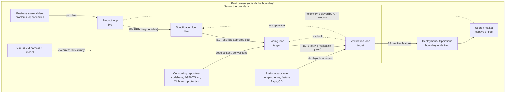

# System Boundary — The Neo Agentic SDLC

**Phase:** boundary-definition (foundation, step 1 of the systems-thinking workflow)
**System under study:** Neo, considered as a *production system whose product is software platforms*.
**Framing question that prompted this analysis:** "We are tasked with building a system that 
builds software platforms."

**Evidence note.** Every claim below is labeled per the `neo-evidence-standard` skill. Locators
are repo paths with line numbers. No external source was retrieved for this document, so no
external claim appears in it. Where the design is silent, that silence is recorded as a `GAP`
rather than filled in.

---

## 1. Purpose

**What the system is supposed to achieve.**

- **FACT** — Neo is spec-driven development with the spec unit shrunk from feature-sized to
  task-sized; the business contract stays at the feature level and the spec moves down to the
  task, "bite-sized, technical, and machine-checkable." `docs/concepts/architecture.md:7`
- **FACT** — The stated point of the system is not the build but the proof: "Specifications
  produce code; verification proves that code has value. A spec that yields running code nobody
  needed has produced nothing." `docs/concepts/architecture.md:9`
- **FACT** — The governing rule is "Verify features, validate tasks. Humans verify, machines
  validate." `docs/concepts/architecture.md:15`, restated at `docs/glossary.md:41`

**Restated as a systems purpose.** Neo converts *business intent* into *verified, deployed
software* at a rate limited by human judgment, while structurally preventing intent from being
laundered through hand-offs. Its output is not code. Its output is **proven value**, and code is
an intermediate stock.

**If the system stopped operating.** Intent would still convert to code — via unaided humans or
unaided agents — but the two proof gates (machine validation at task grain, human verification at
feature grain) would disappear with it. **INFERENCE** — the system's differentiated contribution
is the *gating*, not the *generation*; derived from `docs/concepts/architecture.md:9` (the build
is not the point) plus the gate ownership table at `docs/concepts/process-flow.md:17-23`.

### The purpose mismatch this analysis must record up front

- **FACT** — Neo's documented hierarchy of work is: Problem/opportunity → PRD/Requirements
  (segmented) → Feature (BE-signed) → Task (≈ 1 PR) → Step (≈ 1 commit).
  `docs/concepts/architecture.md:34`
- **GAP** — **Nothing in that chain produces a platform.** Every unit below the PRD is a
  *change to a codebase that already exists*: a Task is "sized to roughly one pull request"
  (`docs/concepts/process-flow.md:63-65`), a Step is "≈ one commit" (`docs/glossary.md:33`), and
  the integration modes both assume a default branch, a repo, and a non-prod environment to deploy
  into (`docs/concepts/process-flow.md:299-338`). Searched `docs/concepts/`, `docs/glossary.md`,
  and `plugins/*/agents/`; found no unit, gate, or agent that establishes a repository, an
  architecture, an environment, a CI/CD pipeline, or a deployment substrate.
- **INFERENCE** — The task as briefed ("a system that builds software *platforms*") is **wider
  than the system as designed** ("a system that builds *features into an existing platform*").
  This is a boundary error of the *too narrow* kind (see §6), and it is the single most consequential
  finding of this phase. Everything downstream — stocks, loops, leverage — is analyzed against the
  system as currently drawn, with the platform-genesis gap carried explicitly as an open question.

---

## 2. The boundary

| Element | Inside / Outside | Rationale |
| --- | --- | --- |
| **Product loop** (`neo-product`: Product Engineer, Product Researchers, three lenses) | **Inside** | Shipped, controlled, and directly serves the purpose — it is where a problem becomes a documented requirement. `docs/concepts/architecture.md:43-46`, `docs/glossary.md:47` |
| **Specification loop** (PRD→Feature via `feature-agent`; Feature→Task via `task-planner`) | **Inside** | `[live]`, shipped in `plugins/neo-core/agents/`. `docs/concepts/architecture.md:47-48` |
| **Coding loop** (Researcher → Implementation Planner → Code Writer → Code Reviewer) | **Inside**, but `[target]` | Agents exist on disk (`plugins/neo-core/agents/`) while the loop internals are explicitly not specced. `docs/concepts/process-flow.md:9`, `docs/concepts/architecture.md:49` |
| **Verification loop** (BE executes feature verification steps in non-prod) | **Inside** | It is the gate that defines the system's purpose. `[target]`. `docs/concepts/process-flow.md:137-150` |
| **The Business Engineer (BE)** — the human seat, occupied by one or more people | **Inside** | Not a customer of the system; an *operator inside it*. The BE owns gates 0, 1, and 3 and co-owns decomposition. A seat with a fixed gate-authority contract, not a named individual — see §4. `docs/glossary.md:9` |
| **The evidence standard** (`neo-evidence-standard`, duplicated into every plugin) | **Inside** | A shipped contract governing what may enter any artifact, per `AGENTS.md` Gotchas. |
| **Operations & Deployment** (SRE Agent, Platform Engineering Agent, CD, telemetry) | **Boundary-straddling** | Named as roles (`docs/glossary.md:23`) and drawn as a loop (`docs/concepts/architecture.md:50`), but **FACT** — "`Operations Space` is drawn outside all the loops in Diagram 2, with no boundary defined between Deployment and Operations." `docs/concepts/process-flow.md:374-375`. Treat as inside-in-intent, outside-in-fact. |
| **The Copilot CLI harness** | **Outside** | Depended on, not controlled. Its behavior has already silently broken shipped components twice (tool aliases; undeclared component paths) — see `AGENTS.md` Gotchas. |
| **The consuming repository** (its `AGENTS.md`, build, test, lint, CI, branch protection) | **Outside** | **FACT** — "The **consuming** repo also needs its own `AGENTS.md` … that is the user's artifact, distinct from this one" (`AGENTS.md`, Gotchas). Neo depends on it and does not control it. |
| **Feature-flag infrastructure, non-prod environments, deployability from an arbitrary branch** | **Outside** | Stated as *obligations* and *entry conditions* the project must already satisfy. `docs/concepts/process-flow.md:311-313`, `326-331` |
| **The LLM / model** | **Outside** | Uncontrolled, non-deterministic input to every agent step. |
| **The market or internal user population** | **Outside — downstream** | Affected by outputs; supplies the telemetry that settles KPIs. `docs/concepts/process-flow.md:196-200` |

---

## 3. Boundary crossings

### Inputs

| Input | Source (upstream) | Characteristics | Assumptions (testable) |
| --- | --- | --- | --- |
| A **problem or opportunity** | Business stakeholders | Irregular arrival, highly variable fidelity | That someone has framed it well enough for research to bite |
| An **existing codebase, repo, and branch model** | The consuming organization | Standing, pre-existing | **Load-bearing and undocumented.** Mode A requires "non-prod must be deployable from an arbitrary feature branch" (`docs/concepts/process-flow.md:312-313`); Mode B requires flag infra already in production use (`:328`) |
| A **consuming `AGENTS.md`** | The consuming repo's maintainers | One document, quality unknown | That it accurately states commands, layout, and commit conventions. Nothing validates this |
| **Gate attention** | The Business Engineer seat — team-held, typically a business SME + technical lead | Scarce, serialized *per feature*, interrupt-driven | That business and technical judgment can be convened together per feature. Throughput scales with convening capacity; intent coherence is preserved by co-presence, not by single ownership (see §4, §11) |
| **Model capability** | The harness vendor | Non-deterministic, version-drifting | That agent output quality is stable enough for gates calibrated against it |
| **Production telemetry** | The deployed system | Delayed by the KPI window | That the instrumentation shipped. **FACT** — "if the telemetry does not exist yet, emitting it is in scope for the feature. A KPI whose instrumentation never shipped is unsettleable, and the outer loop silently breaks." `docs/concepts/process-flow.md:236-238` |

### Outputs

| Output | Destination (downstream) | Characteristics | Commitments |
| --- | --- | --- | --- |
| A **PRD** | The BE, then the Specification loop | One document per opportunity | **FACT** — must be *segmentable*: "a reader can carve it into independent chunks, each carrying its own business justification. That is the contract." `docs/concepts/process-flow.md:42-46` |
| A **BE-signed Feature** | `task-planner` | What + Why + optional KPIs + verification steps | The verification steps *are* the contract. `docs/glossary.md:43` |
| A **Task**, filed as an issue/story | The Coding loop | ≈ 1 PR, machine-checkable validation criteria | **FACT** — a Task *is* the GitHub Issue / ADO story it is filed as. `docs/glossary.md:59` |
| A **draft PR** | Human reviewers on the consuming repo | One per task, validation green | **FACT** — "The PR stays a **draft** — no agent marks it ready or merges it." `docs/concepts/process-flow.md:109` |
| **Conventional-Commits commits** | The consuming repo's history | One per unit | Required format, not a default. `docs/concepts/process-flow.md:116-122` |
| A **verified Feature** | Deployment | All child tasks merged, verification steps passed | `docs/concepts/process-flow.md:141-146` |
| A **rejection record** | The BE, and back into a loop | Per failed verification | **FACT** — must record the failed step, observed vs. promised behavior, the finding, and where it routed. "This record is the loop's learning signal." `docs/concepts/process-flow.md:174-182` |
| A **KPI verdict** | The Specification loop | Post-window, non-blocking | **GAP** — **FACT**: this edge is `[target]` and "the one nothing in the repo currently draws." `docs/concepts/process-flow.md:196-198` |

---

## 4. Actor inventory

| Actor | Role | Decision authority | Key interactions |
| --- | --- | --- | --- |
| **Business Engineer** — a **seat**, not a person; always human | Owns intent from business need through decomposition; executes verification; triages failures | **Highest in the system.** Sole owner of Boundaries 0, 1, and 3 | PRD acceptance, feature sign-off, task-set approval, verification, mis-built/mis-specified routing |
| **Neo Business Engineer** — the *agent* (`neo.business-engineer`, `neo-core`) | Runs the Specification loop on the human's behalf: segments the PRD, sequences Feature Agent and Task Planner, files carrier issues, spawns one session per task | **None over gates.** **FACT** — "It is **not** the Business Engineer — it holds the gates open, it does not pass through them." `docs/glossary.md:25` | Feature Agent, Task Planner, child Technical Engineer sessions, the human at every gate |
| **Product Engineer** (`neo.product.engineer`) | Orchestrates the Product loop; fans out researchers, sequences lenses | Orchestration only — **FACT** "It orchestrates rather than authors." `docs/glossary.md:11` | Researchers, three lenses, hands PRD to BE and stops |
| **Product Researcher** | One scoped discovery question each, in parallel | None | Retrieval; bound by the evidence standard |
| **Product Coach** | Viability lens; also drafts the PRD in Phase 5 | Advisory | `docs/glossary.md:15` |
| **Design Thinking Facilitator** | Desirability lens | Advisory | `docs/glossary.md:15` |
| **Systems Thinking Facilitator** | Feasibility & dynamics lens | Advisory | This document |
| **Feature Agent** | PRD segment → BE-signed Feature | Proposes only; **FACT** — "it does not decompose tasks itself." `docs/concepts/architecture.md:80` | BE, `neo-feature-authoring` skill |
| **Task Planner** | Feature → Task set, interactively | Proposes and surfaces uncertainty; **FACT** — "never autonomous… 'Done' is a BE-approved task set." `docs/concepts/architecture.md:70` | BE |
| **Technical Engineer** | Coding-loop orchestrator | `[target]` | Researcher, Implementation Planner, Code Writer, Code Reviewer |
| **Implementation Planner** | Task → Steps | `[target]` | Code Writer |
| **Code Writer** | Implements a step; owns the commit | Commits when build/lint/tests green | `docs/concepts/process-flow.md:116-118` |
| **Code Reviewer** | Reviews feature/fix and test units | Blocks Boundary 2 | Findings return to writer verbatim; a repeated finding with no progress escalates. `docs/concepts/process-flow.md:111-114` |
| **SRE / Platform Engineering Agent** | Operations & Deployment | `[target]`, undefined boundary | `docs/glossary.md:23` |
| **The harness (Copilot CLI)** | Executes everything | **Silent failure authority** — an unrecognized tool alias or undeclared component path is ignored, not errored (`AGENTS.md` Gotchas) | Every agent |

### The Business Engineer seat is role-held, not head-held — judgment is a team activity

The actor table lists **thirteen** entries for what a conventional software organization would staff
with product management, business analysis, architecture, development, QA, release management, and
SRE. That compression is deliberate, and reading the seat as a single named individual inverts the
point.

- **FACT** — the glossary pairs every seat: "an unprefixed name is a real human being, and its
  **Neo**-prefixed counterpart is the agent that supports that human in the role. The human owns the
  judgment calls and the sign-offs." `docs/glossary.md:9-11`
- **FACT** — the seat is defined by the hand-off it excludes, not by headcount: "never the
  transcription-and-toss-it-over-the-wall BA. You author the feature contract, you sign it, and you
  **stay in the room** through Feature→Task decomposition, because the person who understands the
  intent is the person who should decide what 'done' means." `docs/glossary.md:19`
- **FACT** — stated normatively upstream too: "**No hand-off BA.** The BE owns intent from PRD
  segment through decomposition — no transcribe-and-throw-over-the-wall."
  `docs/concepts/architecture.md:85`
- **FACT (design intent, stated by the Business Engineer in session, 2026-08-29)** — the agent may
  be invoked by one or more product owners, business analysts, and developers. Agentic SDLC
  **flattens** the conventional team's roles; the system needs *less cast of characters*, not a
  faithful digital re-staging of the org chart.
- **FACT (design intent, stated by the Business Engineer in session, 2026-10-03)** — **Neo does not
  prescribe that the Specification and Verification gates fit into one head.** These loops require
  critical thinking and sound judgment, and are *usually a team activity* — typically a **business
  SME and a technical lead, both human**.

**The distinction that matters, and that this analysis previously got wrong.** The rule Neo enforces
is **no hand-off**, which is not the same as **one head**. A hand-off is *sequential*: one person
forms intent, writes it down, and leaves; the next person reconstructs it from the artifact, and the
gap between what was meant and what was written is where intent leaks. Collaboration is
*concurrent*: both parties are present when the decision is made, so nothing has to survive
transmission. The glossary's own phrase for this is "**stay in the room**."

**INFERENCE — intent fidelity is protected by co-presence at the decision, not by
single-headedness.** A business SME and a technical lead deciding together preserve intent better
than one partially-fluent individual deciding alone, because the judgment that must be exercised is
genuinely two-sided: *is this worth building* and *is this buildable as specified*. Derived from
`glossary.md:19` ("stay in the room") and `architecture.md:85` (what is forbidden is the
transcribe-and-throw, not the collaboration).

**INFERENCE — the flattening is the mechanism, not a side effect.** Traditional role proliferation
exists largely to manage hand-offs — each specialist boundary needs a translation artifact and a
meeting to reconcile it. If machines absorb the translation work, those boundaries lose their reason
to exist, and the roles that survive are the ones holding *irreducible judgment*: what is worth
building, and whether what was built delivered it. Flattening removes the **couriers**, not the
**deciders**. Derived from `architecture.md:9`, `:84`, `:85`, and `glossary.md:19`.

**This reverses the constraint finding. See §11 — it is the most consequential correction in this
document.**

**Consequence for this analysis.** Two distinct scarcities, still worth separating:

| Scarcity | Scales by adding people? | Why |
| --- | --- | --- |
| **Gate throughput** — PRD acceptance, feature sign-off, task-set approval, verification, failure triage | **Yes** | Per-feature judgments. More capable pairings means more features in parallel |
| **Intent coherence** — an unbroken chain of intent per feature | **Yes, if they decide together; no, if they decide in sequence** | Co-presence preserves intent; serial transcription is the hand-off `architecture.md:85` forbids |

**INFERENCE — the constraint is a *practice*, not a *person*.** It is not "one human's hours," and
it is not a supply of dual-fluency individuals. It is **the ability to convene business and technical
judgment in the same room and reach a sound decision** — which needs a business SME, a technical
lead, and a reliable method for deciding together. The first two are ordinarily available in any
software organization. The third is the scarce ingredient, and it is a *facilitation standard*, not a
hiring problem. Superseded detail in §11; carried into stock-and-flow as a revised capability stock.

**Open sub-question, revised.** The design fixes *what the seat owns* but is silent on *who convenes
the pairing*, and on whether the composition may change between a feature's signing and its
verification. **GAP** — searched `docs/glossary.md`, `docs/concepts/`, and
`plugins/neo-core/agents/neo.feature-agent.agent.md`; no convening or continuity rule found. Under
team-held judgment this is where the removed hand-off can silently reappear — not by splitting a
chain across *individuals*, but by letting the *composition* drift so that nobody present at
verification was present at signing.

---

## 5. The neighborhood

**Coupling notes.**

| Neighbor | Sends / receives | Coupling | What breaks if it changes |
| --- | --- | --- | --- |
| Copilot CLI harness | Executes every agent, skill, hook | **Tight and undeclared** | **FACT** — an unrecognized tool alias is "silently ignored — not an error", and researchers declaring `[read, search, web, todo]` "received only `view` and filled the gap with recalled training data wearing invented citations." `AGENTS.md`, Gotchas. A harness change can degrade evidence quality with no signal |
| Consuming repository | Supplies context and conventions; receives commits and PRs | Tight, contractual, unverified | If its `AGENTS.md` is wrong or missing, the Coding loop's commits and commands are wrong |
| Platform substrate | Supplies non-prod and (Mode B) flags | Tight at Boundary 3 | Without a deployable non-prod, verification cannot run and the system's defining gate cannot fire |
| Users / market | Receive features; emit telemetry | **Loose to the point of disconnection** | The KPI edge is undrawn (`docs/concepts/process-flow.md:196-198`), so this coupling is currently aspirational |
| Deployment / Operations | Receives verified features | **Undefined** | `docs/concepts/process-flow.md:374-375` records the missing boundary as an open item |

---

## 6. Boundary validation

Checked against the four standard boundary errors.

**Too narrow — confirmed, and this is the headline finding.**
The brief says *build software platforms*; the design describes *changing an existing platform*.
Concretely, the system as drawn has no unit, gate, agent, or artifact for: repository genesis,
architectural decision, environment provisioning, CI/CD construction, or the choice of the very
substrate that Boundary 3 assumes. **FACT** — Mode A lists "Non-prod must be deployable from an
arbitrary feature branch" as an *obligation on the project*, not as work the system performs
(`docs/concepts/process-flow.md:312-313`). **INFERENCE** — Neo currently presupposes the platform
it would be asked to build. Any "platform-building" ambition needs either a fifth loop upstream of
Product, or an explicit declaration that platform genesis is a human precondition.

**Leaky — confirmed, two places.**

1. **FACT** — the Operations → Specification edge, which carries KPI settlement, is `[target]` and
   undrawn. `docs/concepts/process-flow.md:196-198`. The system's stated purpose is proving value
   (`docs/concepts/architecture.md:9`), and the only mechanism that can prove value is the one edge
   that does not exist.
2. **FACT** — no boundary is defined between Deployment and Operations.
   `docs/concepts/process-flow.md:374-375`

**Too wide — not found.** The exclusions (harness, model, consuming repo, substrate) match the
control test: each is depended on and none is controlled.

**Static — confirmed.** The boundary is drawn over a system that is roughly half `[target]`:
Product and Specification are `[live]`; Coding and Verification are not specced
(`docs/concepts/architecture.md:41`, `:94`). A boundary over a system whose downstream half is
unbuilt is provisional by construction. **INFERENCE** — the `[live]`/`[target]` split is itself a
system fact worth carrying forward: *the two loops that produce specifications are built, and the
two loops that produce proof are not*, which inverts the stated priority at
`docs/concepts/architecture.md:9`.

**Reflexive — confirmed, and unavoidable.** Neo is being used to analyze Neo. The system under study
appears in its own environment: this document is an output of the Product loop's systems-thinking
lens, written about the loop that produced it, into the repo that is also the consuming repo. Three
consequences follow, and they are load-bearing rather than cosmetic.

1. **The boundary cannot be drawn cleanly, because the analyst is inside it.** The Systems Thinking
   Facilitator is listed in §4's actor inventory. An actor cannot fully externalize a system it
   operates within — its blind spots are the system's blind spots. **The correct response is not to
   pretend otherwise but to bound the claim**: everything here is a *structural* reading of the
   design as written, and structural readings are exactly the kind a participant can still make
   honestly. Behavioral claims — how it actually performs under load — require an outside observer
   or instrumentation, and this analysis makes none.
2. **Neo is its own upstream supplier, and this is the circularity worth naming.** The handbook that
   teaches the practice is the inflow to the capacity to convene judgment, and that capacity gates every loop
   — including the one that would produce the handbook. **INFERENCE** — the system needs its
   constraint already relieved in order to relieve its constraint. Derived from the capability and
   documentation flow tables in
   `../system-models/neo-agentic-sdlc-stocks-flows.md` §3, §6. This is a **bootstrap condition**,
   not a defect: every self-hosting system has one, and the resolution is always the same — an
   external, manual first turn of the crank that the system does not perform on itself.
3. **Self-application is also the strongest available evidence.** The circularity buys something.
   Neo dogfooding Neo exercises the loops against a real workload before an external client's
   throughput depends on them, and the defects this analysis surfaced (unsettled KPIs having no
   outflow, platform debt having no stock, the unowned draft-PR merge) were found *by* running the
   process, not by inspecting it
   from outside. **INFERENCE** — a system that cannot be usefully applied to itself would be weaker
   evidence, not stronger.

**What reflexivity forbids.** Two failure modes to guard against for the remainder of this analysis:
treating a gap in *Neo's own docs* as a gap in *the design* when it may be only a gap in the
writing; and using the convenience of this repo as a proxy for an adopter's repo, whose people,
documentation, and
substrate all start in a materially worse state. Where the two diverge, the adopter's case governs.

- **FACT** — Diagram 2's expanded sub-box is labeled "Specification Loop" but contains the Coding
  loop phases. `docs/concepts/process-flow.md:371-373`
- **FACT** — Testing is modeled twice and incompatibly: as its own phase after Implement, and as
  test units interleaved with feature units. "Two different models of the same phase."
  `docs/concepts/process-flow.md:129-134`

---

## 7. Open questions and assumptions to revisit

1. **Is "platform" in scope, and at what grain?** Building a *platform* implies decisions —
   architecture, substrate, environments, pipelines — that have no unit in
   `docs/concepts/architecture.md:34` and no gate in `docs/concepts/process-flow.md:17-23`. Resolve
   before any further phase, because it determines whether the boundary drawn here is the right one.
2. **Who convenes the pairing at each gate, and what is the decision rule?**
   Partly resolved: the seat is role-held, not head-held, and judgment is team-held by design (§11).
   What remains open is **the decision rule** — consensus, single-member veto, or an accountable
   signer who must convene but decides. The system's constraint is not one human's hours but **the
   capacity to convene business and technical judgment together**, which §11 revises from a scarce
   kind of person to a facilitation practice. **Assumption to test in delay analysis.**
3. **What settles a KPI when the outer edge does not exist?** Until the Operations → Specification
   edge is drawn, the system can verify problem–solution fit but cannot establish value fit
   (`docs/concepts/process-flow.md:204-222`).
4. **Where does platform-level technical debt accumulate?** No stock in the design holds it; the
   unit chain has no place to file it.
5. **Does anything detect harness-induced silent degradation?** The `AGENTS.md` Gotchas record two
   past instances. There is no monitor named in the design.

---

## 8. Handoff

This boundary feeds **stock-and-flow-mapping** and **upstream-downstream-synthesis**. Candidate
stocks visible already, to be confirmed in the next phase, are: unsegmented PRDs, BE-unsigned
features, approved-but-unstarted tasks, open draft PRs awaiting human readiness, merged-but-
unverified features, features shipped with unsettled KPIs, and un-cleaned feature flags under
Mode B (**FACT** — "un-cleaned flags accumulate into a second, undocumented configuration
surface", `docs/concepts/process-flow.md:337-338`).

---

## 9. Reconciliation — `origin/main` merge, 2026-09-03

This analysis was drafted against commit `b81d965`. Twenty commits from `origin/main` were merged in
(fast-forward, no conflicts). Three change the analysis materially. Recorded here rather than
silently rewritten, because *what changed and when* is itself system information.

### 9.1 The Business Engineer is now two things, and the split is normative

**FACT** — the glossary now separates the roles explicitly: "'Business Engineer' is always a person,
'Neo Business Engineer' is always software." `docs/glossary.md:12-13`. The abbreviation **BE** is
retired in favor of full names; §4 above is updated accordingly, and any remaining "BE" in this
document should be read as the human seat.

**FACT** — a new agent shipped: `plugins/neo-core/agents/neo.business-engineer.agent.md` (commit
`54e1017`). It orchestrates the whole Specification loop — segment, sequence Feature Agent and Task
Planner, file carrier issues, spawn one child session per task, steer them to draft PRs.

**This does not relieve the constraint identified in §4, and the design says so directly.**

- **FACT** — "**You are not the Business Engineer.** The BE is a human … **The human signs.** Every
  gate below is theirs." `plugins/neo-core/agents/neo.business-engineer.agent.md:59-60`
- **FACT** — "**Both gates are human.** … Recommend, summarize, argue your case — then stop and
  wait." `:141-142`
- **FACT** — "the orchestrator drafts, sequences, and spawns, but **you sign the feature and you
  approve the task set**. It cannot sign for you." `docs/guides/using-neo.md:61-63`

**INFERENCE — the agent relieves attention, not capability, and that is the intent.** The sequencing,
filing, spawning, and collecting work is absorbed. The judgment at the five gates is explicitly
retained by the human.

**FACT (design intent, stated by the Business Engineer in session, 2026-09-05)** — the goal is not to
reduce the need for human judgment. It is to relieve people of mundane work such as drafting feature
text, and to give them a standard for running design-thinking and systems-thinking workshops. **Human
judgment and critical thinking are not replaceable by the models and never should be.**

The consequence to manage: because drafting is automated while judgment is deliberately retained, one
operator can drive more features in parallel, so each qualified person is asked for *more* gate
decisions per unit time. Faster arrival into an unchanged server deepens the queue. Derived from the
facts above plus the capability/attention split in
[`../system-models/neo-agentic-sdlc-stocks-flows.md`](../system-models/neo-agentic-sdlc-stocks-flows.md) §2.

**This is the predictable cost of a correct choice, not a defect** — and it names where investment
belongs. If drafting is automated and judgment is not, then growing and supporting judgment is the
whole game: a documentation, training, and facilitation-standard problem rather than an agent
problem. Carried to causal-loop-mapping as loop candidate L6, whose counter-loop is the handbook, not
a weakened gate.

### 9.2 The handbook gap is partly closed — and it closed exactly as predicted

**FACT** — `docs/guides/using-neo.md` now exists, addressed "For the **operator** — usually the
**Business Engineer**" (`:3-4`), alongside `installing-neo.md` and `filing-work.md`.

The stock-and-flow map called the handbook the inflow to the capacity to convene judgment, and argued
that **the documentation loop cannot self-start** — that the manual would have to be hand-authored outside the pipeline, and that
doing so would feel like a process violation. It was then hand-authored outside the pipeline. **The
bootstrap prediction was borne out by the very commits that arrived while this document sat open.**
Weak evidence — one instance, and the analysis was not causal to it — but the right *kind* of
evidence, and labeled `INFERENCE`, not proof.

The handbook is no longer empty. It remains **thin against the constraint**: the guides teach *which
agent to invoke in what order*, which builds operators. Whether they build people who can *sign a
feature and co-carve its task set* — the judgment the gates demand — is unestablished, and per §9.1
the handbook must also carry a standard for running design-thinking and systems-thinking workshops.
**Open question, restated:** does the handbook build the capacity to convene sound judgment, or only
make existing people faster at operating the tools?

### 9.3 Enforcement is opt-in — silent degradation confirmed, and worse than modeled

**FACT** — "Nothing enforces this for you — Neo's guardrail hook is opt-in and ships unregistered
(`docs/contributing/guides/enforcement.md`) — so treat this line as the safeguard."
`plugins/neo-core/agents/neo.business-engineer.agent.md:151-153`

Silent harness degradation was modeled as *components that stopped working without erroring*.
This is a stronger version: a guardrail that **never started working**, documented as such, with a
prose instruction standing in for a mechanism. **INFERENCE** — "never commit to `main`, never merge,
draft PRs only" is currently enforced by agent compliance, not by the system. Its failure mode is
silent by construction.

### 9.4 Boundary re-validation

The §6 verdicts are unchanged in kind. The *too narrow* finding (platform genesis has no unit) and
both *leaky* findings (the undrawn KPI edge; no Deployment→Operations boundary) remain open — none
of the twenty commits addressed them. The *static* finding softens slightly: the Specification loop
gained an orchestrator, so more of the design is `[live]` than when this was drafted. The Coding and
Verification loops remain `[target]`. The *reflexive* finding is unchanged and, per §9.2, mildly
reinforced.

---

## 10. Reconciliation — `origin/main` merge, 2026-10-03

Twelve commits, fast-forward. One correction and one new finding; details and evidence in
[`../system-models/neo-agentic-sdlc-stocks-flows.md`](../system-models/neo-agentic-sdlc-stocks-flows.md) §10.

### 10.1 Correction — the human gates are two populations, not one

§4 and §9.1 treat "the gates" as one set throttled by a single supply of people. That was wrong.
**FACT** — the Coding loop carries its own mandatory human gates: "**Two user gates are mandatory:**
ask for `/fleet` before research and planning, and for `/rubber-duck` after planning and before
implementation." `plugins/neo-core/agents/neo.technical-engineer.agent.md:127`

| Gate population | Gates | Judgment required | Supply |
| --- | --- | --- | --- |
| **Specification / verification** | PRD acceptance, feature sign-off, task-set approval, feature verification, failure triage | **Two-sided** — business *and* technical judgment, ordinarily two people in the room | Scarce in *practice*, not in people — see §11 |
| **Coding loop** | `/fleet`, `/rubber-duck`, marking a draft PR ready | **Technical only** | Far more available |

**INFERENCE — the constraint is narrower than this document previously stated.** Only the first
population needs the rare combination. The earlier framing overstated the bottleneck by counting
every human checkpoint against the scarce pool. The constraint is the five
specification-and-verification gates. Derived from the sources above plus the actor inventory in §4.

Consequence for the handbook: it needs **two tracks** — a technical-operator track, and a judgment
track covering feature signing, task carving, and the design-thinking and systems-thinking workshop
standards named in §9.1.

### 10.2 A second deliberately installed brake, and the principle behind both

**FACT** — the Implementation Planner's unit derivation is now "bounded by cohesion," merging units
that would necessarily change together, because "each extra unit adds a full implement→review cycle."
`plugins/neo-core/agents/neo.implementation-planner.agent.md:29`

This supplies a **lower bound on unit size** that existed at task grain
(`neo-task-authoring/SKILL.md:41-42`) but was missing one level down. More importantly it is the
third instance of a single design principle: **Neo relocates a downstream cost to the upstream moment
of decision** — proof authored at definition, feature-size pain surfaced at decomposition, and now
review overhead priced at unit derivation. **INFERENCE** — this is a deliberate collapsing of
feedback delays, which is why the design favors human gates at *authoring* moments over inspection at
*failure* moments. Carried to delay-analysis and leverage-point-analysis as a named principle.

### 10.3 Boundary re-validation

Unchanged in kind. The *too narrow* finding (platform genesis still has no unit), both *leaky*
findings, and the *reflexive* finding all stand. No commit in this range addressed them.

---

## 11. Correction — the constraint is a practice, not a scarce kind of person

**Date:** 2026-10-03. **Supersedes** the capability claims in §4 and §9.1, and the corresponding
sections of the stock-and-flow map.

### 11.1 What was wrong

This analysis asserted that the Specification and Verification gates require "business fluency and
technical fluency **in the same head**," and concluded that Neo's binding constraint is a scarce,
slow-refilling supply of dual-fluency individuals.

**That was an over-reading, and the citation under it has since gone stale.** The claim rested on an
earlier glossary line describing "the single human who owns a feature." The current glossary does not
say that. It says the human "author[s] the feature contract, … sign[s] it, and **stay[s] in the
room** through Feature→Task decomposition." `docs/glossary.md:19`

**FACT (design intent, stated by the Business Engineer in session, 2026-10-03)** — Neo does **not**
prescribe that these gates fit into one head. The Specification and Verification loops require
critical thinking and sound judgment, and are *usually a team activity* — typically a **business SME
and a technical lead, both human**.

### 11.2 The distinction the original analysis collapsed

| | **Hand-off** — what Neo forbids | **Collaboration** — what Neo assumes |
| --- | --- | --- |
| Timing | Sequential | Concurrent |
| Artifact | Must carry the full intent, alone | Supports a conversation; need not be complete |
| Where intent leaks | Between writing and reading | Nowhere — both parties are present at the decision |
| Neo's phrase | "transcription-and-toss-it-over-the-wall" (`glossary.md:19`) | "stay in the room" (`glossary.md:19`) |

**INFERENCE** — "no hand-off" is a constraint on *sequence*, not on *headcount*. One partially-fluent
person deciding alone is **worse**, not better, than a business SME and a technical lead deciding
together: the judgment required is genuinely two-sided — *is this worth building* and *is this
buildable as specified* — and a single head spanning both tends to be weaker on one side.

### 11.3 The revised constraint, and why it matters more than the correction itself

The scarce ingredient is not people. It is **the method for convening them**:

| Ingredient | Availability | Refill mechanism | Delay |
| --- | --- | --- | --- |
| A business SME | Ordinarily present | Already employed | None |
| A technical lead | Ordinarily present | Already employed | None |
| **A reliable standard for deciding together** | **Scarce** | **Documentation and facilitation practice** | **Short — it is writing, not hiring** |

**INFERENCE — this converts the bottleneck from intractable to tractable.** You cannot hire
dual-fluency unicorns at scale; nothing fixes that constraint quickly. You *can* write and teach a
facilitation standard. The earlier analysis identified the right chokepoint and misidentified its
nature, which would have pointed investment at recruiting and training individuals rather than at
codifying a practice.

**This closes the loop with the handbook requirement.** The Business Engineer's earlier instruction —
that the handbook must carry **a standard for running design-thinking and systems-thinking
workshops** — is not an adjacent nicety. It *is* the mechanism that relieves the constraint. A
workshop standard is precisely a reliable method for making a business SME and a technical lead
exercise judgment together. The handbook's judgment track is therefore not "train someone to have
both fluencies"; it is "give a pairing a dependable way to decide."

### 11.4 Downstream effects on earlier findings

| Earlier finding | Status after this correction |
| --- | --- |
| The capability stock refills slowly, via training | **Revised.** It refills via documentation and facilitation practice — a much shorter delay |
| Gate saturation → burnout → attrition is a collapse engine | **Weakened.** A team-held gate has no single point of failure; losing one participant does not empty the seat |
| Orchestration loads the constraint (§10.1, L6) | **Still holds, but less sharply.** Faster arrival still meets a judgment-rate ceiling, but that ceiling rises as the facilitation standard spreads |
| Hand-over mid-feature reintroduces the hand-off | **Reframed.** The risk is not splitting a chain across individuals; it is letting the *composition* drift, so nobody present at verification was present at signing |

### 11.5 This resolves an open question the repo already carries

**FACT** — the repo's own gap analysis records **G5 — single-human vs team-with-veto entry gate**,
scoring it "**Untracked (likely by-design)**" and noting: "The entry gate is a single human (BE).
Robust against committee-softening, but is the single point of failure principle 7 flags."
`docs/contributing/design/framework-gap-analysis.md:110`, with the narrative at `:144-147`.

G5 was written against the same single-human reading this section corrects. The design intent stated
in §11.1 answers it: judgment at these gates is **team-held by design**. Two consequences:

1. The "single point of failure" concern G5 raises is **substantially reduced** — it was an artifact
   of the single-human reading.
2. G5's remaining live question is **not** *single vs. team* but **what the decision rule is** —
   consensus, single-member veto, or an accountable signer who must convene but decides. **GAP** —
   searched `docs/glossary.md`, `docs/concepts/process-flow.md`, and
   `plugins/neo-core/agents/neo.business-engineer.agent.md`; no decision rule is specified. Under
   team-held judgment this is now the live design question, and it belongs in the handbook alongside
   the workshop standards.

**Recommendation.** `framework-gap-analysis.md` G5 should be updated to reflect this intent; it
currently encodes a reading the design authority has corrected. Flagged, not actioned — that file is
outside this analysis's remit.
