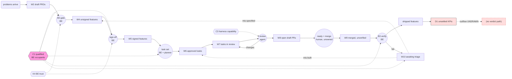

# Stock-and-Flow Map — The Neo Agentic SDLC

**Phase:** stock-and-flow-mapping (foundation, step 2)
**Requires:** [`docs/design/system-boundaries/neo-agentic-sdlc.md`](../system-boundaries/neo-agentic-sdlc.md)
**Feeds into:** causal-loop-mapping

**Evidence note.** Labeled per `neo-evidence-standard`. Locators are repo paths with line numbers.
No external source was retrieved, so no external claim appears here. **No quantitative level or rate
in this document is measured** — Neo's Coding and Verification loops are `[target]`
(`docs/concepts/architecture.md:94`) and no instrumentation exists. Every "current state" below is
therefore structural (what the design permits or prevents), never numeric. That restraint is the
point: a fabricated queue depth would be worse than none.

---

## 1. Core question

> **What accumulates in Neo, and which accumulation limits the rate at which business intent becomes
> proven value?**

Two sub-questions carried forward from boundary definition:

1. **Test the capability hypothesis** — is the binding constraint the *capacity to convene sound
   judgment at the gates*, rather than any work queue? (Revised 2026-10-03; originally framed as a
   supply of dual-fluency individuals — see §11.)
2. **Locate the stocks with no outflow** — under the rule *every stock must have at least one inflow
   and one outflow*, a missing outflow is either a boundary error or an unbounded accumulation. Both
   are findings.

---

## 2. Stock inventory

Stocks are grouped by category. **Trend** is structural, not measured.

**On the IDs.** Row labels are shorthand for cross-referencing tables and diagrams only: `W` =
work-in-progress, `C` = capability and attention, `K` = knowledge and trust, `D` = quality and debt.
Prose names the stock, never the ID.

### Work-in-progress stocks (the pipeline)

| # | Stock | Description | Unit | Structural trend |
| --- | --- | --- | --- | --- |
| W1 | **Unframed problems** | Opportunities raised but not yet through Product-loop research | problems | Arrival-driven; ungated |
| W2 | **Draft PRDs awaiting BE acceptance** | Produced by the Product loop, queued at Boundary 0 | PRDs | Rises with BE gate latency |
| W3 | **Accepted-but-unsegmented PRDs** | Passed Boundary 0; not yet carved into segments | PRDs | Hidden queue — see §5 |
| W4 | **Unsigned draft features** | `feature-agent` output awaiting BE sign-off | features | Rises with BE gate latency |
| W5 | **Signed features awaiting decomposition** | BE-signed; no approved task set yet | features | Rises with BE gate latency |
| W6 | **Approved tasks not started** | BE-approved task set, unclaimed by the Coding loop | tasks | The Coding loop's input buffer |
| W7 | **Tasks in the review loop** | Under review → fix → re-review inside the Coding loop | tasks | Oscillates; bounded only by escalation |
| W8 | **Open draft PRs** | Validation green, awaiting human readiness/merge | PRs | **FACT** — "The PR stays a **draft** — no agent marks it ready or merges it." `docs/concepts/process-flow.md:109` |
| W9 | **Merged-but-unverified features** | All child tasks landed; verification not yet executed | features | The pre-Boundary-3 buffer |
| W10 | **Features awaiting failure triage** | Verification failed; mis-built / mis-specified call not yet made | features | **FACT** — triage is "a **human investigation step**". `docs/concepts/process-flow.md:153-155` |

### Capability and attention stocks

| # | Stock | Description | Unit | Structural trend |
| --- | --- | --- | --- | --- |
| C1 | **Capacity to convene sound judgment** | Pairings — typically a business SME + technical lead — that can actually be convened to decide | pairings | **The hypothesis under test.** Refill is a practice, not a hire |
| C2 | **Uncommitted BE attention** | Occupant-hours not already consumed by open gates | person-hours / period | Drained by every gate and every triage |
| C3 | **Agent/harness capability** | What the model and harness can actually do this release | capability | Exogenous, drifts without notice |

### Knowledge and trust stocks

| # | Stock | Description | Unit | Structural trend |
| --- | --- | --- | --- | --- |
| K1 | **Intent fidelity per feature** | How much of the original business intent survives to the code | fidelity | The stock Neo is architected to protect |
| K2 | **Rejection records** | The loop's learning signal | records | **FACT** — "This record is the loop's learning signal." `docs/concepts/process-flow.md:181` |
| K3 | **Documented usage knowledge** | Docs telling an adopter how to *operate* Neo | documents | **Partly filled as of 2026-09-03** — see §9 |
| K4 | **BE trust in agent output** | Willingness to accept a gate artifact without re-derivation | perception | Set by evidence discipline; destroyed by fabrication |

### Quality and debt stocks

| # | Stock | Description | Unit | Structural trend |
| --- | --- | --- | --- | --- |
| D1 | **Unsettled KPI hypotheses** | Features shipped with a KPI, verdict not returned | hypotheses | **Rising, unbounded — see §6** |
| D2 | **Un-cleaned feature flags** (Mode B only) | Flags left after verification | flags | **FACT** — they "accumulate into a second, undocumented configuration surface." `docs/concepts/process-flow.md:337-338` |
| D3 | **Feature-branch drift** (Mode A only) | Divergence between a feature branch and the default branch | commits behind | **FACT** — "merge pain that grows with feature size." `docs/concepts/process-flow.md:314-315` |
| D4 | **Platform-level technical debt** | Architectural/substrate debt that fits no unit in the hierarchy | defects / complexity | **No stock exists for it — see §6** |
| D5 | **Silent harness degradation** | Components that stopped working without erroring | defects | **FACT** — an unrecognized alias is "silently ignored — not an error." `AGENTS.md`, Gotchas |

---

## 3. Flows

### The pipeline chain

The defining structural property: **the outflow of each pipeline stock is a gate, and most gates are
the same seat.**

| Stock | Inflows | Outflows | Converters (set the rate) |
| --- | --- | --- | --- |
| W2 draft PRDs | Product-loop synthesis completes | **Boundary 0 acceptance (BE)** | PRD *segmentability* — the stated contract, `docs/concepts/process-flow.md:42-46`; C2 attention |
| W4 unsigned features | `feature-agent` drafts from a PRD segment | **BE sign-off** | Presence of What + Why + verification steps, `docs/concepts/architecture.md:66`; KPI falsifiability, `process-flow.md:227-234` |
| W5 signed features | Sign-off | **BE-approved task set** | **FACT** — decomposition is "interactive and collaborative … never autonomous." `docs/concepts/architecture.md:70`. Rate is bounded by *joint* human+agent time, not agent time |
| W6 approved tasks | Task-set approval | Coding loop claims a task | Coding-loop parallelism; C3 |
| W7 tasks in review | Reviewer requests changes | Reviewer approves | **FACT** — findings return "verbatim"; a stalled loop (same finding twice, no progress) escalates to a human. `plugins/neo-core/agents/neo.technical-engineer.agent.md:78,104` |
| W8 open draft PRs | Validation green + review approved | **A human marks ready and merges** | Human availability — *not* a BE-specific gate, and the one gate the design leaves unowned |
| W9 merged-unverified features | Last child task lands (the fan-in) | **Boundary 3 verification (BE)** | **FACT** — availability of a deployable non-prod, `process-flow.md:312-313`; the fan-in itself, `:124-127` |
| W10 features in triage | Verification fails | A routing verdict: mis-built / mis-specified / both | **FACT** — "A failed verification does not carry its own diagnosis." `process-flow.md:152-153` |

**Probe — hidden inflow.** Tasks in the review loop and features awaiting triage both receive
**rework**, an inflow generated *by the system's
own output*. Rework re-enters upstream of where it was produced: mis-built returns to Coding,
mis-specified returns to Specification (`process-flow.md:159-163`). These are the system's principal
circular structures and are flagged for causal-loop-mapping.

**Probe — unmeasured outflow.** Unframed problems, draft PRDs, and approved-but-unstarted tasks each
have an unmodeled drain: **abandonment**.
Nothing in the design expires a stale PRD, a superseded feature, or an approved task overtaken by
events. **GAP** — searched `docs/concepts/`, `docs/glossary.md`; no aging, expiry, or cancellation
rule found. Un-drained work queues silently convert into K3-style documentation debt and stale
context for every agent that reads the repo.

### C1 — Capacity to convene sound judgment at the gates (the hypothesis, revised 2026-10-03)

**Unit revised.** This stock was originally modeled as *people with business and technical fluency in
one head*. Per the design intent recorded in
[`../system-boundaries/neo-agentic-sdlc.md`](../system-boundaries/neo-agentic-sdlc.md) §11, judgment
at these gates is **team-held** — typically a business SME and a technical lead, both human. The
stock is therefore **capable pairings that can actually be convened**, not qualified individuals.

| Inflows | Outflows | Converters |
| --- | --- | --- |
| A facilitation standard that lets an SME and a tech lead decide together reliably; practice reps; the design-thinking and systems-thinking workshop standards | Participants reassigned or unavailable; calendars that prevent convening; composition drift between signing and verification | **The method, not the headcount** — the scarce ingredient is a dependable way to decide jointly, since both participants are ordinarily already employed |

**INFERENCE — the hypothesis holds in location but not in nature.** Neo's flattening does not reduce
the total judgment required; it **concentrates** it. The translation labor that occupied hand-off
roles is absorbed by machines (`architecture.md:85`), while the judgment those roles carried — *is
this worth building* and *is this buildable as specified* — remains, and remains human. But
flattening removes the **couriers**, not the **deciders**: the two-sided judgment is still exercised
by two people in the room, not compressed into one. Derived from `glossary.md:19` ("stay in the
room") + `architecture.md:70`, `:85`.

**The corollary that matters for adoption, restated.** The bottleneck is **the facilitation standard**
— a dependable method for a business SME and a technical lead to decide together — not a supply of
dual-fluency individuals. An organization adopting Neo already employs both participants. What it
lacks is the practice. **INFERENCE** — that makes the refill delay *short*, because the inflow is
documentation and rehearsal rather than hiring or multi-year skill growth. This remains the system's
presumptive constraint, but a tractable one. Carried to causal-loop-mapping and delay-analysis.

### K1 — Intent fidelity

| Inflows | Outflows | Converters |
| --- | --- | --- |
| One person carrying a feature end-to-end; proof authored at definition time (`architecture.md:24-28`) | **Hand-offs** — each one leaks; **hand-over mid-feature** (the `GAP` from boundary §4); vague verification steps | The no-hand-off-BA rule, `architecture.md:85`; the segmentability contract |

Intent fidelity is the stock Neo exists to protect, and the one stock with **no instrument**. Its
depletion is only observable indirectly — as a mis-specified verdict at Boundary 3, months
downstream.

### K4 — Trust in agent output

| Inflows | Outflows | Converters |
| --- | --- | --- |
| Gate artifacts that survive scrutiny; retrievable locators | **One fabricated citation**; a silently-degraded agent producing confident nonsense | The evidence standard — a shipped contract per `AGENTS.md`, Gotchas |

**INFERENCE** — trust is asymmetric: it fills slowly through repeated verified artifacts and empties
in a single event. **FACT** — the evidence standard exists precisely because a report of "confident
'HIGH FACT' claims … were **recalled training data with fake citations**" nearly reached executives
(`neo-evidence-standard` skill). If trust empties, the Business Engineer re-derives every artifact by
hand, and the system's throughput advantage disappears while its cost remains.

---

## 4. The diagram

The diagram makes one thing visually obvious: **the capacity to convene judgment dashes into five
separate gates.** Every pipeline stock's outflow is throttled by the same converter.

---

## 5. Stock interactions — where loops will form

Flagged for causal-loop-mapping, not analyzed here.

1. **Capacity to convene judgment → all gate rates → all pipeline stocks.** A single converter on
   five outflows. If it is depleted, *every* queue grows at once — which presents as "the process is slow"
   rather than "we don't have enough people who can staff the gates," and invites the wrong fix.
2. **Failed verifications → unsigned features / approved tasks.** The rework circuits. Note the
   asymmetry: mis-specified rework re-enters *further upstream* and so consumes gate attention a
   second time, at the most expensive gates.
3. **Gate saturation → attention depletion → participants become unavailable.** Burnout and calendar
   pressure as genuine outflows on the capability stock. A reinforcing collapse candidate, though
   weaker than first modeled — a team-held gate has no single point of failure (§11.4).
4. **Trust in agent output → gate rate.** Low trust means the Business Engineer re-derives artifacts
   by hand, which consumes attention, which saturates gates, which drives attrition. A second path
   into the same collapse.
5. **Accepted-but-unsegmented PRDs are a hidden queue.** Boundary 0 gates on *segmentability*
   (`process-flow.md:42-46`), but the segmenting act itself has no owner, no artifact, and no gate.
   **GAP** — searched `docs/concepts/process-flow.md` and `docs/glossary.md`; the Business Engineer
   is said to segment, but nothing defines a segment's form or when segmentation is done.
6. **Branch drift ← feature size → verification difficulty.** **FACT** — Mode A's merge pain is
   partly deliberate: "a feature too large to hold on a branch is almost certainly too large for the
   BE to verify as a single judgment anyway. The pain shows up early." `process-flow.md:316-318`.
   A designed balancing loop; name it as such in the next phase.

---

## 6. Stock health — the three structural defects

Applying the rule *every stock must have at least one inflow and one outflow*.

### D1 — Unsettled KPI hypotheses: **inflow, no outflow**

| Desired | Current | Gap | Time to critical |
| --- | --- | --- | --- |
| Every shipped KPI receives a verdict after its window | Verdicts have no path back | The entire outer loop | Immediate — the stock has never drained |

**FACT** — the Operations → Specification edge is `[target]` and "the one nothing in the repo
currently draws." `docs/concepts/process-flow.md:196-198`. **FACT** — the system's stated purpose is
that "verification proves that code has value." `docs/concepts/architecture.md:9`.

**INFERENCE** — Neo can currently establish **problem–solution fit** and cannot establish **value
fit** (`process-flow.md:204-222`). Its defining claim rests on the one flow that does not exist.
This is not a missing feature; it is the stock-and-flow signature of a broken purpose.

### D4 — Platform technical debt: **no stock at all**

Nothing in the work hierarchy (`architecture.md:34`) can hold architectural or substrate debt: it is
not a Feature (no business Why), not a Task (no parent Feature), and not a Step. **INFERENCE** — debt
that has nowhere to be filed does not stop accumulating; it accumulates *unmeasured*, surfacing later
as slowed flow rates across every stock at once. This compounds the boundary-definition finding that
Neo presupposes the platform it would be asked to build.

### K3 — Usage knowledge: **the adoption bottleneck**

| Desired | Current | Gap | Trend |
| --- | --- | --- | --- |
| An adopter can learn to *operate* the loop | Docs describe what Neo *is* and how to *contribute to it* | The operating manual | Worsening as design outpaces documentation |

**FACT** — `docs/README.md` is a two-door hub: user docs at the top level, contributor docs under
`docs/contributing/` (`AGENTS.md`, Gotchas). **FACT** — `architecture.md` and `process-flow.md`,
which carry the operating model, sit under `docs/concepts/` — the *shared core* both doors point at,
not the user door.

**INFERENCE — this is the mechanism behind the pause you called.** The handbook is the **inflow to
the capacity to convene judgment**. That capacity is produced by documentation that teaches the
practice — including the workshop standards; without it that supply cannot refill, and it throttles all five gates.
**Documentation is not downstream of this system — it is the supply line to its binding constraint.**
Derived from the capability flow table plus the documentation gap above.

**The bootstrap condition.** Handbook → capacity to convene judgment → every gate → *including the
gates that would produce the handbook*. The system needs its constraint already relieved in order to relieve it.
A genuine circular reference, recorded rather than resolved in
[`../system-boundaries/neo-agentic-sdlc.md`](../system-boundaries/neo-agentic-sdlc.md) §6 under
*Reflexive*. Two practical implications:

- **The documentation loop cannot self-start.** Documentation → capability → throughput is
  reinforcing, which means it is equally capable of running backward or of never starting. A
  reinforcing loop at zero stays at zero. Something outside it must place the first increment.
- **The first turn of the crank is manual by necessity, not oversight.** Writing the handbook is work
  Neo cannot route through its own pipeline, because that pipeline is gated by the capability the
  handbook creates. Expect to hand-author it, and expect that to feel like a process violation. It is
  not — it is the standard cost of self-hosting.

---

## 7. Open questions — unmeasured flows and unknown converters

1. **Nothing in Neo measures Neo.** Every stock above is structural. `AGENTS.md` names
   `scripts/analyze_agent_logs.py` (per-agent/per-run log stats) — a *harness* instrument, not a
   *pipeline* one. **GAP** — no queue depth, cycle time, gate latency, or rework rate is emitted.
2. **How many people in a real adopting organization could staff the seat?** Unmeasurable from this
   repo. The single highest-value question to ask a client.
3. **Who marks a draft PR ready and merges it?** No role in the design claims that flow. **GAP** —
   searched `docs/concepts/process-flow.md:92-134` and
   `plugins/neo-core/agents/neo.technical-engineer.agent.md`; no owner named.
4. **What drains stale problems, PRDs, and approved tasks?** No expiry or cancellation rule exists.
5. **What is a PRD "segment," formally?** Unsegmented PRDs are a queue with no defined artifact.
6. **What detects silent harness degradation?** It has bitten twice per `AGENTS.md`, and no monitor
   is named.
7. **Does the handbook teach judgment, or only operation?** Per §9.2 it must eventually carry
   feature-signing, task-carving, and the design-thinking and systems-thinking workshop standards.

---

## 8. Handoff to causal-loop-mapping

Carry forward these five loop candidates:

| # | Candidate | Likely type | Why it matters |
| --- | --- | --- | --- |
| L1 | Gate saturation → attention depletion → participants unavailable → worse saturation | Reinforcing (collapse) | The capability-collapse engine; weakened by team-held gates (§11.4) |
| L2 | Mis-specified rework re-consuming the most expensive gates | Reinforcing | Rework is most costly exactly where capacity is scarcest |
| L3 | Trust loss → re-derivation by hand → attention drain | Reinforcing (collapse) | A second path into L1 |
| L4 | Feature size → branch drift → merge pain → smaller features | **Balancing, and designed** | `process-flow.md:316-318` — a deliberately installed brake |
| **L7** | **Unit count → review-cycle overhead → fewer, more cohesive units** | **Balancing, and designed** | Added 2026-10-03 (#106). The second deliberate brake — see §10 |
| L5 | Handbook → capacity to convene judgment → gate throughput | Reinforcing (growth, currently inactive) | The adoption engine, not yet switched on |

**Verdict on the hypothesis carried in from boundary definition.** Supported, and strengthened. The
capacity to convene sound judgment at the gates **throttles five outflows at once**, and its
**inflow is documentation that does not yet exist**. Treat it as the system's presumptive constraint
until measurement says otherwise — but see §11: it is a *practice* to be codified, not a scarce kind
of person to be recruited.

---

## 9. Reconciliation — `origin/main` merge, 2026-09-03

Drafted against `b81d965`; twenty commits merged fast-forward. Terminology first: **the abbreviation
"BE" is retired.** `docs/glossary.md:12-13` now fixes "Business Engineer" as always a person and
"Neo Business Engineer" as always software. Read "BE" above as the human seat.

### 9.1 A Specification-loop orchestrator shipped — and it loads the constraint rather than relieving it

**FACT** — `plugins/neo-core/agents/neo.business-engineer.agent.md` (commit `54e1017`) segments the
PRD, sequences Feature Agent and Task Planner, files carrier issues, and spawns one child session per
task.

Map it onto the flow tables in §3 and the split is clean:

| Stock | Effect of the new agent |
| --- | --- |
| **C2 uncommitted attention** | **Relieved.** Segmenting, sequencing, filing, spawning, steering, and collecting are absorbed |
| **C1 qualified occupants** | **Untouched.** Every gate remains human by explicit design |

- **FACT** — "**You are not the Business Engineer** … **The human signs.** Every gate below is
  theirs." `plugins/neo-core/agents/neo.business-engineer.agent.md:59-60`
- **FACT** — "It is **not** the Business Engineer — it holds the gates open, it does not pass through
  them." `docs/glossary.md:25`

**This is the design working as intended, and the intent must be stated before the dynamic is read.**

**FACT (design intent, stated by the Business Engineer in session, 2026-09-05)** — the operating
model's goal is **not** to reduce the need for human judgment. It is to (a) relieve people of mundane
work such as drafting feature text, and (b) give them a standard for running design-thinking and
systems-thinking workshops. **Human judgment and critical thinking are not replaceable by the models
and never should be.**

That intent is already visible in the shipped design: the gates are human *by construction*, not by
omission (`neo.business-engineer.agent.md:59-60`, `:141-142`; `docs/glossary.md:25`), and the
Product loop ships the three lenses as facilitated methods rather than as generators of answers.

**INFERENCE — augmentation is the goal, and it has a consequence to manage.** Because drafting is
absorbed while judgment is deliberately retained, the capacity to convene judgment (C1) governs
throughput more tightly than before: relieving attention (C2) raises the rate at which work arrives
at the gates, while the gates' service rate stays fixed by how often a sound decision can be convened.
Faster arrival into an unchanged server deepens the queue. Derived from the flow tables in §3 plus
the facts above.

**This is not a defect and should not be "fixed" by weakening a gate.** It is the predictable cost of
a correct choice, and it names where investment must go: if drafting is automated and judgment is
not, then **growing and supporting judgment is the whole game** — which is a documentation, training,
and facilitation-standard problem, not an agent problem.

Recorded as loop candidate **L6 — orchestration relieves attention → more features in flight → more
gate decisions per person → gate saturation**, which reaches the collapse engine (L1) by a new path.
Its correct counter-loop is the documentation-and-training loop (L5), not gate removal. Carried to
causal-loop-mapping.

**The draft-PR question is partially resolved.** §7 asked who owns the flow from draft PR to merge.
Still no owner, but the
prohibition hardened: **FACT** — "Child sessions end at **draft** PRs; leave them that way for a
human." `neo.business-engineer.agent.md:151-152`. The flow is deliberately unowned by any agent; a
human must claim it. Whether any *named role* does remains a `GAP`.

### 9.2 The handbook gap is partly filled — and the bootstrap played out as described

**FACT** — `docs/guides/using-neo.md` exists, addressed "For the **operator** — usually the
**Business Engineer**" (`:3-4`), with `installing-neo.md` and `filing-work.md` alongside.

§6 argued **L5 cannot self-start** — a reinforcing loop at zero stays at zero, so the manual must be
hand-authored outside the pipeline, and doing so would feel like a process violation. It was then
hand-authored outside the pipeline, in the same window this document sat open. **INFERENCE, not
proof** — one instance, and this analysis was not causal to it.

**The manual is switched on but running weak, and its scope is now known to be wider than "how to
invoke the agents."** `using-neo.md` teaches which agent to invoke in what order. That produces
**operators** — attention-side literacy. What the gates actually demand is the ability to **sign a
feature** and **co-carve a task set**, and per the design intent in §9.1 the handbook must also carry
**a standard for running design-thinking and systems-thinking workshops** — the facilitated methods
the Product loop's lenses depend on. None of that is written yet.

**Revised open question:** does the handbook build the capacity to convene sound judgment, or only
make existing people faster at operating the tools? On present evidence, mostly the latter — and
closing that gap is the highest-value documentation work available, because that capacity is what
governs throughput.

### 9.3 Silent degradation confirmed, and stronger than modeled

**FACT** — "Neo's guardrail hook is opt-in and ships unregistered … so treat this line as the
safeguard." `neo.business-engineer.agent.md:151-153`

The silent-degradation stock (D5) modeled *components that stopped working without erroring*. This is
worse: a guardrail that
**never started**, with prose standing in for a mechanism. **INFERENCE** — the no-commit-to-`main`
and draft-PR-only rules are enforced by agent compliance, not by the system, and their failure mode
is silent by construction.

### 9.4 Unchanged

Unsettled KPIs (still no outflow), platform technical debt (still no stock), the undefined PRD
segment, and the absence of any pipeline instrumentation are all untouched by the
twenty commits. The §6 verdicts stand.

### 9.5 Revised loop-candidate list for causal-loop-mapping

| # | Candidate | Type | Status after merge |
| --- | --- | --- | --- |
| L1 | Gate saturation → attention depletion → participants unavailable | Reinforcing (collapse) | **Weakened** by team-held gates (§11.4) |
| L2 | Mis-specified rework re-consuming the most expensive gates | Reinforcing | Unchanged |
| L3 | Trust loss → re-derivation by hand → attention drain | Reinforcing (collapse) | Unchanged |
| L4 | Feature size → branch drift → merge pain → smaller features | Balancing, designed | Unchanged |
| L5 | Handbook → capacity to convene judgment → gate throughput | Reinforcing (growth) | **Now active, weakly** — teaches operation, not judgment |
| **L6** | **Orchestration relieves attention → more features in flight → more gate decisions per person → saturation** | **Reinforcing (collapse)** | **New.** The consequence of augmentation, to be met with L5, not with weaker gates |

---

## 10. Reconciliation — `origin/main` merge, 2026-10-03

Twelve commits, merged fast-forward. Two are version/model housekeeping; one is substantive.

### 10.1 A lower bound on unit size — the missing half of Neo's central rule

**FACT** — the Implementation Planner's first procedure step was *"Derive the smallest set of discrete
units that satisfy every acceptance criterion."* It now reads *"…bounded by cohesion,"* and adds:
**"Merge same-kind candidate units … that would necessarily change together"** and **"each extra unit
adds a full implement→review cycle, so only split when pieces are genuinely independently reviewable
and independently valuable."** `plugins/neo-core/agents/neo.implementation-planner.agent.md:29`
(commits `f2fb743`, `423c129`).

**Why this is more than a prompt tweak.** Neo's central bet is *shrink the unit* —
"spec-driven development with the spec unit shrunk from feature-sized to task-sized"
(`docs/concepts/architecture.md:7`). Shrinking is the move the whole framework is built on. But a
pure "derive the smallest set" instruction is an **unbounded minimization**, and the design had
already recognized that danger one level up and installed a bound there:

| Grain | Upper bound | Lower bound | Gate |
| --- | --- | --- | --- |
| **Task** (Feature→Task) | "Too big … → split into multiple tasks" | "Too small (cannot stand as its own PR …) → fold into a sibling" `neo-task-authoring/SKILL.md:41-42` | Human — Business Engineer approves the task *set* |
| **Unit** (Task→Steps), *before* | "smallest set" | **none** | Human — `/rubber-duck` |
| **Unit** (Task→Steps), *after* | "smallest set" | "bounded by cohesion"; merge units that change together | Human — `/rubber-duck` |

**INFERENCE** — the lower bound existed at task grain and was missing at unit grain; this change
restores the symmetry. Derived from the two sources in the table.

**Why unbounded minimization is specifically costly here.** Each unit carries a **fixed overhead** —
a full implement→review cycle, and **FACT** — a unit "counts as done only after `code-reviewer` has
reviewed and approved it" (`neo.implementation-planner.agent.md:30`), with findings looping back to
the writer until approval (`neo.technical-engineer.agent.md:78`). So the review loop is not a single
pass; it is an iteration whose length is bounded only by escalation. **INFERENCE** — total cost is
therefore not linear in unit count: every additional unit is another entry into a loop with a long
tail, so over-splitting inflates the tasks-in-review stock superlinearly. Derived from the unit
inventory in §2 plus the two facts above.

Recorded as loop candidate **L7 — unit count → review-cycle overhead → fewer, more cohesive units**:
balancing, and deliberately installed.

### 10.2 The pattern both designed brakes share — Neo collapses feedback delays to the decision point

This is the finding worth carrying forward, because it is a *philosophy*, not an incident. Three
separate mechanisms in the design do the same structural thing:

| Mechanism | Cost normally discovered… | …but is made visible at |
| --- | --- | --- |
| **Proof at definition** — verification steps authored at feature time, validation criteria at task time (`architecture.md:24-28`) | Months later, when nobody can say whether it worked | The moment the unit is defined |
| **Mode A merge pain** — feature branch drift grows with feature size | At merge, after the feature is built | Decomposition: **FACT** "The pain shows up early, at decomposition, rather than late." `process-flow.md:316-318` |
| **Cohesion bounds** — review-cycle overhead per unit | Across many slow review loops, diffusely | The moment units are derived |

**INFERENCE — Neo's recurring structural move is to shorten the delay between a decision and the
consequence that should inform it.** Delays are the dominant source of system surprise; a cost paid
far from the choice that caused it cannot discipline that choice. Each mechanism above relocates a
consequence to the moment of authoring. Derived from the three sources in the table.

In leverage terms this is not parameter-tuning. These are **information-flow and rule changes** —
higher-leverage classes — and they explain why the design keeps choosing human gates at *authoring*
moments rather than inspection gates at *failure* moments. Carry to delay-analysis and
leverage-point-analysis as a named design principle, not as three coincidences.

### 10.3 A correction to the constraint analysis — the gates are not one population

Verifying this change surfaced an error in the earlier analysis. §9 and the boundary document treat
"the gates" as a single set throttled by one supply of people. **FACT** — the Coding loop has its own
mandatory human gates: "**Two user gates are mandatory:** ask for `/fleet` before research and
planning, and for `/rubber-duck` after planning and before implementation."
`neo.technical-engineer.agent.md:127`

These are not the same gates, and **they do not demand the same qualification**:

| Gate population | Gates | Judgment required |
| --- | --- | --- |
| **Specification / verification** | PRD acceptance, feature sign-off, task-set approval, feature verification, failure triage | **Two-sided** — business *and* technical judgment, ordinarily two people in the room |
| **Coding loop** | `/fleet` before research, `/rubber-duck` on the plan, marking a draft PR ready | **Technical only** — no business fluency needed |

**INFERENCE — this softens the constraint finding, and the earlier statement was too pessimistic.**
The scarce, slow-refilling supply is only required for the first population. The coding-loop gates can
be staffed by developers who never need to carry business intent, and that is a far more available
pool. The bottleneck is real but **narrower** than previously described: it is the five
specification-and-verification gates, not every human checkpoint in the system. Derived from the
sources in the table above, correcting §9.1 and boundary §4.

This also sharpens the handbook question in §9.2: the handbook needs **two tracks**, not one — a
technical-operator track for the coding-loop gates, and a judgment track (feature signing, task
carving, and the design-thinking and systems-thinking workshop standards) for the scarce population.

### 10.4 Housekeeping, noted for completeness

**FACT** — all thirteen agents bumped models (`Claude Opus 5.5` / `Claude Sonnet 5.5` with GPT
fallbacks, commit `57b251d`), and plugin versioning is now automated on merge to main
(`.github/workflows/version-bump.yml`, `scripts/bump-versions.py`, commit `5cf36b3`); neo-core is
2.3.0, neo-product 2.2.0.

The model bump is the *agent capability* stock (C3) moving — the one §2 describes as "exogenous,
drifts without notice." Here the drift is deliberate and upward, but the stock's character is
unchanged: nothing in the system measures whether agent output actually improved, so the change is
invisible to every downstream gate except through human impression. This remains the open question
in §7 about what detects silent degradation.
