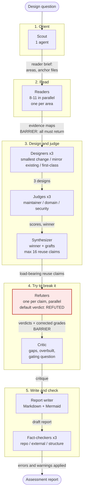

# neo-arc

**Status: live.** The Architecture Assessment loop's agents are authored and invokable. Installable as a working crew.

## What this plugin is

`neo-arc` ships the **Architecture Assessment loop** — a repeatable method for answering an architecture design
question with evidence from the codebase. The questions it fits share a shape: integrate platform X, add capability Y,
choose between two patterns, change a contract or data model. The output is a **report** with a recommended shape, a
phased plan, verified reuse claims, the decisions only the user can make, and the single question that gates the design.

It is optional and stands beside the other loops rather than between them. A team can run it before writing a PRD (to
learn what the codebase will bear), alongside the Specification loop (to settle a design question a feature raises), or
on its own. It never invokes another loop, and it never edits code, ADRs, or PRDs — the ADR and PRD work it recommends
are separate, human-reviewed steps.

The method's design record is
[`docs/contributing/design/neo-arc-method.md`](https://github.com/skyarkitekten/neo/blob/main/docs/contributing/design/neo-arc-method.md).

## Shape

- **Orchestrator:** `neo.architecture-engineer.agent.md` — **Neo Architecture Engineer**. Select it as your
  session agent.
- **Stages** — a fixed skeleton; the scale knob is the number of readers and refuters, never the shape:
  1. **Scout** — one run; produces the reader brief. Nothing spawns until it exists.
  2. **Readers** — one per area, in parallel (eight to eleven for a full question, plus one for any named external
     product). **Barrier.**
  3. **Designers** — three in parallel, one angle each: smallest change; mirror an existing subsystem; first-class.
  4. **Judges** — three in parallel, one lens each: repository maintainer; domain architect; security and governance.
  5. **Synthesizer**, then **refuters** — one per load-bearing reuse claim, in parallel, capped at sixteen, defaulting
     to "refuted" when unconfirmed. **Barrier.**
  6. **Critic** — what nobody read, what is unverified or overbuilt, and the sharpest question.
  7. **Report**, then **fact-checkers** — three in parallel: repository facts, external claims, document structure.
     Errors and warnings are applied before the report is presented.



- **Contracts:** every worker returns one fixed Markdown template and nothing else. Each worker's file owns its
  template; the orchestrator checks the headings, re-runs once on a mismatch, and records a second failure rather than
  retrying.
- **Output:** a Markdown report with Mermaid figures (plus a self-contained HTML companion on request), written to the
  reports folder the consuming repo's `AGENTS.md` names — default
  `docs/design/assessments/<YYYY-MM-DD>-<topic>-assessment.md`. Never staged or committed by the loop.
- **Follow-ups** re-enter at the scout with two to four areas, using the earlier evidence map as context, not evidence.

## What's inside

**Agents** (`agents/`, `neo.<role>.agent.md`):

| File | Agent `name:` | Role | Runs |
| --- | --- | --- | --- |
| `neo.architecture-engineer.agent.md` | `Neo Architecture Engineer` | Orchestrates the loop; the entry point. `user-invocable` | 1 |
| `neo.arc-scout.agent.md` | `Neo Arc Scout` | Reader brief: areas, anchor files, keyword hits, what the question means | 1 |
| `neo.arc-reader.agent.md` | `Neo Arc Reader` | One area of the codebase, or the named external product, in the Reader template | one per area, parallel |
| `neo.arc-designer.agent.md` | `Neo Arc Designer` | One design from one assigned angle | 3, parallel |
| `neo.arc-judge.agent.md` | `Neo Arc Judge` | Scores all designs through one assigned lens | 3, parallel |
| `neo.arc-synthesizer.agent.md` | `Neo Arc Synthesizer` | Phased recommendation and its load-bearing reuse claims (max 16) | 1 |
| `neo.arc-refuter.agent.md` | `Neo Arc Refuter` | Tries to break one reuse claim; returns a corrected grade | one per claim, parallel |
| `neo.arc-critic.agent.md` | `Neo Arc Critic` | Completeness critique and the sharpest question | 1 |
| `neo.arc-report.agent.md` | `Neo Arc Report` | Writes the report, carrying the refuters' corrected grades | 1 |
| `neo.arc-factcheck.agent.md` | `Neo Arc Factcheck` | Checks the written report for one check kind | 3, parallel |

Angles and lenses are passed in the prompt, not baked into separate agent files, so the same files serve every
question. Every worker is read-only; only the orchestrator (applying fact-check fixes) and the report writer edit, and
only the report.

The agents are **stack- and project-agnostic**. Layout, conventions, the reports folder, and the governing documents
come from the consuming repo's `AGENTS.md`, ADRs, and PRDs — never baked into a prompt.

**Skills** (`skills/`):

| Skill | Owns |
| --- | --- |
| `neo-evidence-standard` | The retrieval-or-silence rule and the `FACT` / `INFERENCE` / `RECALL — UNVERIFIED` labels every stage uses. A byte-identical copy of `neo-core`'s — duplicated, not shared |

**Hooks** (`hooks/hooks.json`, v1 schema, `${PLUGIN_ROOT}`): the same registered fail-open observability logging, and
the same **unregistered, opt-in** guardrail scripts, as `neo-core` — via this plugin's own
`hooks/scripts/log-event.{sh,ps1}` and `hooks/scripts/enforce-guardrails.{sh,ps1}`, which are byte-identical copies of
`neo-core`'s (duplicated, not shared — plugins cannot reference files outside their own directory; see
[`plugin-contract.md`](https://github.com/skyarkitekten/neo/blob/main/docs/contributing/reference/plugin-contract.md#1-plugin-folder-shape)).
Because they are copies they can drift: keep all of them in step when you change one.

## Cost

The source method sizes a full run at roughly 30 to 40 agents and a follow-up at 10 to 20 (see the design record). Sizing the reader set to the question is the lever —
the design, judge, and critic stages are a fixed cost. Ask a narrow question when a narrow answer will do.

## Why a new plugin and not a `neo-core` addition

`docs/contributing/reference/stack-plugin-contract.md` treats a domain wanting its own agent as a signal to check
first, not a routine extension. Answer recorded here: architecture assessment is a distinct, optional loop — Process-tier
content (roles, orchestration, proof mechanisms) that many teams will never run, and that runs on its own cadence rather
than inside the Specification or Coding loop. It does not replace `neo-core`'s `researcher` (which investigates how the
code works for one already-specified task) or `neo-product`'s lenses (which decide whether to build). It ships as a
**loop plugin** so teams that don't need it carry none of its ten agents.

## Install

```
copilot plugin marketplace add skyarkitekten/neo
copilot plugin install neo-arc@neo
```

Stands alone; pairs with `neo-product` and `neo-core` when its recommendations feed a PRD or a feature.

## License

MIT
